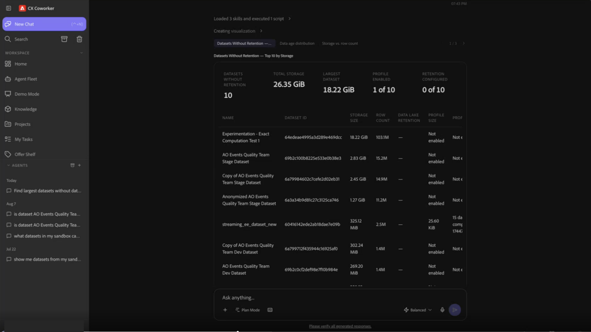
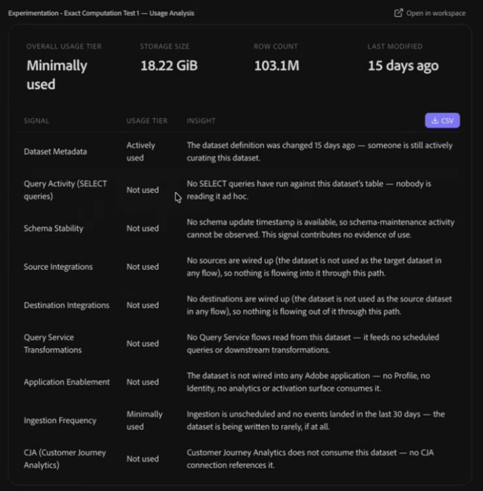
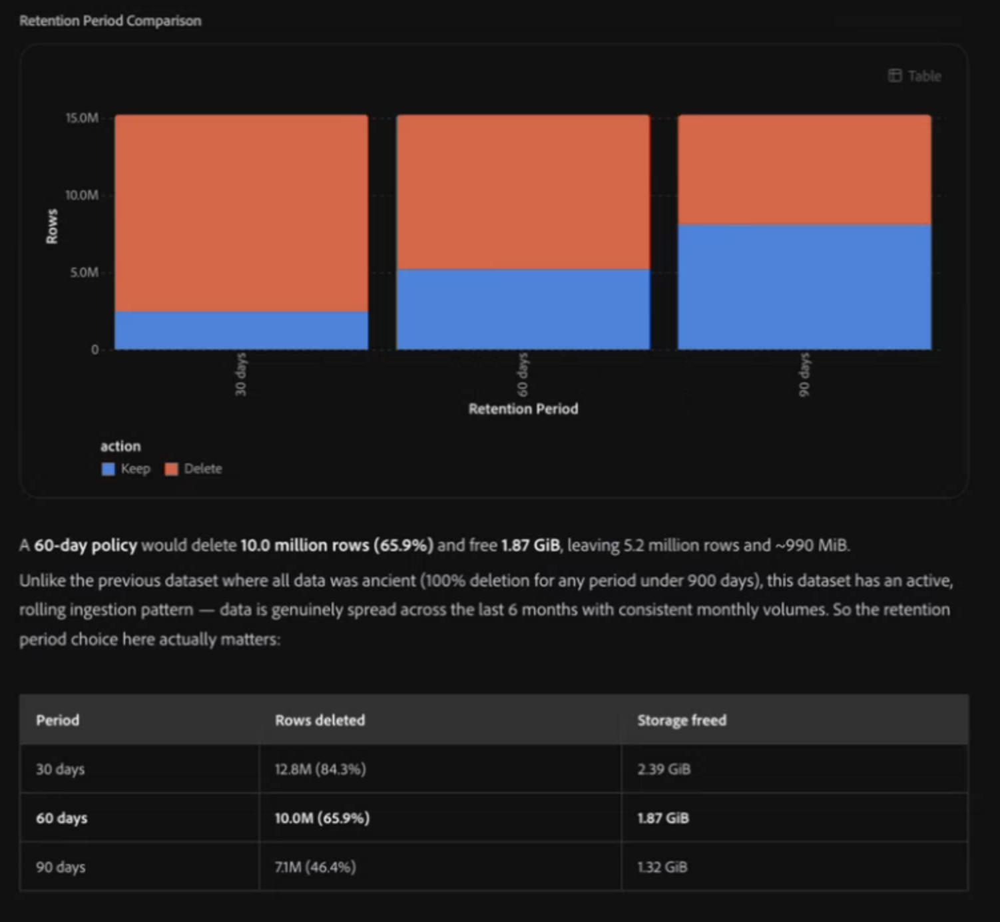
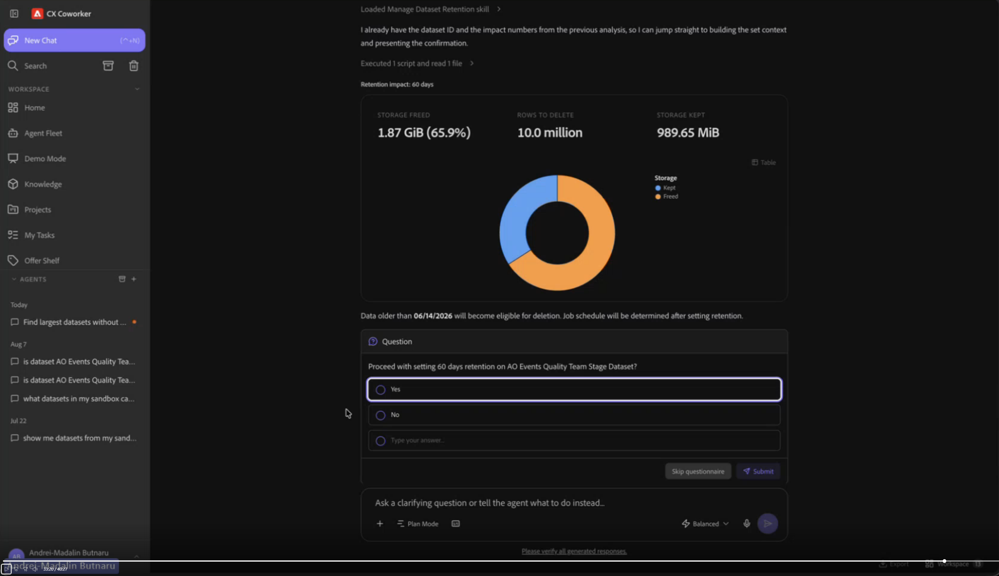
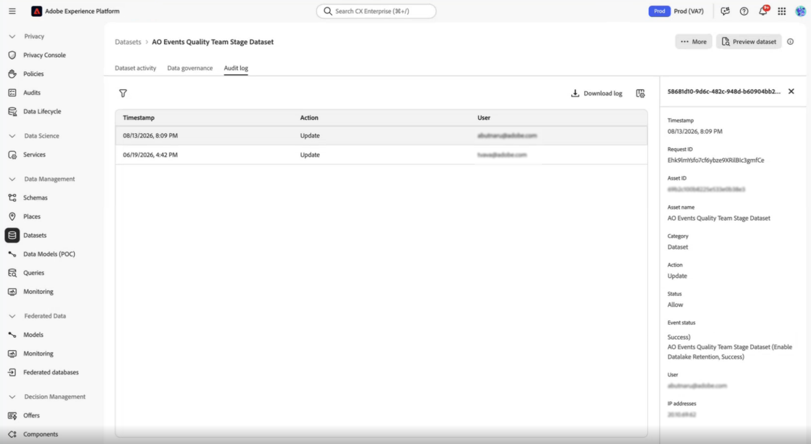

# Data Management Agent

>[!AVAILABILITY]
>
>The Data Management Agent is available to all customers with access to Adobe CX Enterprise Coworker.

To understand and manage data lake retention for your Experience Event datasets, use the Data Management Agent in CX Coworker. As datasets in your Adobe Experience Platform data lake grow, queries and downstream applications that depend on them can slow down, and managing data retention requirements becomes harder. Describe what you want to accomplish in natural language. The Data Management Agent finds the relevant Experience Event datasets, analyzes how actively they're used, and models how much data a candidate retention period would affect. When you're ready to act, it helps you set, change, or remove a retention policy and asks for your confirmation before anything changes.

## What the Data Management Agent can do {#what-the-data-management-agent-can-do}

The Data Management Agent provides four skills.

| Skill | Description |
|---|---|
| **List datasets** | Use when deciding where to start a retention review. Lists your Experience Event datasets with storage size, row count, existing retention settings, and profile enablement so you can quickly identify retention candidates. |
| **Analyze dataset usage** | Use before deciding whether a dataset is a good retention candidate. Classifies how actively a specific dataset is used based on signals such as recent ingestion, query activity, and downstream application usage. |
| **Analyze dataset retention** | Use before committing to a retention period. Shows a dataset's storage metrics and the age of its data, then models, as an approximation based on that age distribution, how much data a candidate retention period would keep or remove. |
| **Manage dataset retention** | Use when you're ready to act. Sets, changes, or removes a data lake retention policy on a dataset, with an impact preview and confirmation before anything changes. |

## Scope: data lake retention vs. other data management tools {#scope}

Use the Data Management Agent when you need to find and analyze Experience Event datasets and set, change, or remove a data lake retention policy.

These skills don't manage the following related capabilities:

- **Profile store retention policy.** To manage how long Experience Events remain in the Profile store, configure an Experience Event expiration policy on Profile-enabled Experience Event datasets. See [Experience Event expiration](https://experienceleague.adobe.com/en/docs/experience-platform/profile/event-expirations).
- **Sandbox-wide pseudonymous profile data expiration.** To automatically delete pseudonymous profile data across a sandbox once it meets the configured conditions, see [Pseudonymous profiles](https://experienceleague.adobe.com/en/docs/experience-platform/profile/pseudonymous-profiles).
- **Dataset expiration.** To schedule an entire dataset for deletion on a future date, see [Dataset expiration](https://experienceleague.adobe.com/en/docs/experience-platform/data-lifecycle/ui/dataset-expiration).
- **Record Delete.** To remove individual profile records for privacy or hygiene reasons, see [Record Delete](https://experienceleague.adobe.com/en/docs/experience-platform/data-lifecycle/ui/record-delete).

## Prerequisites {#prerequisites}

Before you begin, ensure that you have:

- Access to Adobe Experience Platform and the sandbox that contains the datasets you want to review.
- The Adobe Experience Platform permissions required for the datasets and retention actions you want to use. The Data Management Agent uses your existing Experience Platform permissions and does not grant additional access. See the [Access control overview](https://experienceleague.adobe.com/en/docs/experience-platform/access-control/home) for how Adobe Experience Platform permissions and roles work.
- The Adobe CXO plugin installed in CX Coworker.

For instructions on installing plugins, see the [Coworker UI guide](https://experienceleague.adobe.com/en/docs/cx-enterprise-ai/experience-cloud-ai/coworker/chat/ui-guide).

## Use the Data Management Agent {#use-the-data-management-agent}

Interact with the Data Management Agent through CX Coworker using natural language. Describe your goal as clearly as possible, then refine the results with follow-up questions.

>[!NOTE]
>
>Before you begin, make sure you're working in the sandbox that contains the datasets you want to review.

To use the Data Management Agent:

1. Navigate to **[!UICONTROL CX Coworker]**. For access details, see the [Coworker UI guide](https://experienceleague.adobe.com/en/docs/cx-enterprise-ai/experience-cloud-ai/coworker/chat/ui-guide).
1. Enter a request. For example:

   *"Show me my largest event datasets."*

1. Review the results.
1. To investigate a specific dataset, ask a follow-up question. For example:

   *"How actively is my Web Events dataset being used?"*

1. If you decide to set, change, or remove a retention policy, review the impact preview and confirm the request before the change is applied.

## Supported use cases {#supported-use-cases}

Use these skills together as a workflow: start broad by finding your largest datasets, narrow down by checking how actively a dataset is used and modeling the impact of a candidate retention period, then set, change, or remove a retention policy once you're ready to act.

### Find your largest datasets {#find-your-largest-datasets}

To decide where to start a retention review, identify your largest Experience Event datasets and the ones most likely to need attention. Use the List datasets skill to review storage size, row count, existing retention status, and profile enablement. You can filter the results by criteria such as dataset size, row count, or recent access to narrow the list. The skill is read only. Coworker returns a table you can scan and compare, along with visualizations that highlight datasets by size, row count, and data age.

Once you've narrowed the list, use the Analyze dataset usage skill to find out how actively a specific dataset is used.

Not every unused or abandoned dataset surfaced by this skill is eligible for a data lake retention policy. See [Scope](#scope) for related tools that may be a better fit. Before setting a data lake retention policy, confirm that the dataset is an Experience Event dataset.

Example prompts:

- "Show me my largest event datasets."
- "Show me datasets larger than 100 GB that don't have data lake retention set."
- "I need to remove about 2 TBs of data. Where should I start?"
- "Can you help me find data that's orphaned, abandoned, or unused?"
- "Prioritize datasets with no access in the last 90 days."

### Check how actively a dataset is used {#check-how-actively-a-dataset-is-used}

Before you decide whether a dataset is a good candidate for a retention policy, find out how actively it is being used. Use the Analyze dataset usage skill to evaluate a specific dataset across nine usage signals. These signals include recent ingestion activity, query activity, schema stability, and whether the dataset feeds other Adobe Experience Platform applications. The skill is read only. Coworker returns an overall usage tier, a breakdown of the signals, and a plain language summary of what they indicate about the dataset.

<!-- TODO: Confirm the final usage-tier thresholds with engineering after the planned update from a 7-day to a 30-day analysis window is complete. Update this section with the final definitions before publishing. -->

Example prompts:

- "How actively is my Web Events dataset being used?"

### Deep dive into a dataset's retention posture {#deep-dive-into-a-datasets-retention-posture}

Before you commit to a specific retention period, find out what it would actually keep or remove. Use the Analyze dataset retention skill to review a dataset's storage metrics and the age distribution of its data. It also models how much data a candidate retention period would keep or remove, based on that age distribution. Coworker shows the estimated impact by row count and storage size.

The skill is read only. Coworker returns the data age and impact analysis directly in the conversation, so you can compare the results with the dataset's current retention settings before deciding whether to change them.

Example prompts:

- "What would be the impact if I set a 60-day retention period on this dataset?"

### Set, change, or remove a retention policy {#set-change-or-remove-a-retention-policy}

Once you've decided on a retention period, use the Manage dataset retention skill to set, change, or remove a data lake retention policy on a dataset. The skill shows you the proposed impact before making any change. It applies the policy only after you explicitly approve the request. Describing the change you want does not apply it.

>[!IMPORTANT]
>
>The minimum data lake retention period is 30 days; shorter periods aren't supported.

After you confirm a retention policy, it may take a short time for the change to appear in the Adobe Experience Platform UI. The retention policy does not delete expired data immediately. The initial retention job starts within 24 hours after the policy is applied. After the initial run, a scheduled job evaluates and deletes expired records every 30 days. See the [Experience Event dataset retention (TTL) guide](https://experienceleague.adobe.com/en/docs/experience-platform/catalog/datasets/experience-event-dataset-retention-ttl-guide) for more information about retention and purging.

Every retention policy change is recorded in an audit trail, including when a policy is set, changed, or removed. The audit trail records who made the change, when it was made, and what changed. You can follow the link provided by Coworker to review these events in the dataset's Audit log tab in Adobe Experience Platform. For more information, see the [Audit logs overview](https://experienceleague.adobe.com/en/docs/experience-platform/landing/governance-privacy-security/audit-logs/overview).

Example prompts:

- "Set the retention on this dataset to 60 days."
- "Remove the retention policy on this dataset."

## How the Data Management Agent works {#how-the-data-management-agent-works}

The Data Management Agent uses deterministic calculations to analyze dataset usage, so the same inputs produce the same usage tier. It also calculates retention impact programmatically rather than relying on AI generated estimates. Retention impact remains an approximation because it is based on the age distribution of the data. The agent retrieves information directly from Adobe Experience Platform services to provide current information about your datasets.

## Best practices {#best-practices}

Keep the following practices in mind when using the Data Management Agent:

- **Start with discovery.** Use the List datasets skill to review your largest datasets and any that appear unused or abandoned before you analyze an individual dataset.
- **Review the impact preview before you confirm.** Review what would be kept and removed before you approve a retention change.
- **Allow time for changes to appear.** After you confirm a retention change in CX Coworker, allow a short time for the Adobe Experience Platform UI to reflect the change.

## Limitations {#limitations}

The Data Management Agent can identify potential retention candidates, but it does not decide which datasets require a retention policy. It does not apply, change, or remove a retention policy without your explicit confirmation.

## Next steps {#next-steps}

After reading this guide, you should understand how to use the Data Management Agent in CX Coworker to find, analyze, and manage data lake retention on your Experience Event datasets.

For more information about how data lake retention policies work in Adobe Experience Platform, including retention behavior and configuration, see [Experience Event dataset retention (TTL) guide](https://experienceleague.adobe.com/en/docs/experience-platform/catalog/datasets/experience-event-dataset-retention-ttl-guide).
