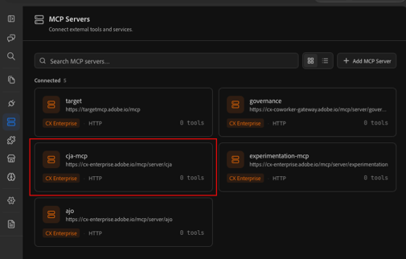
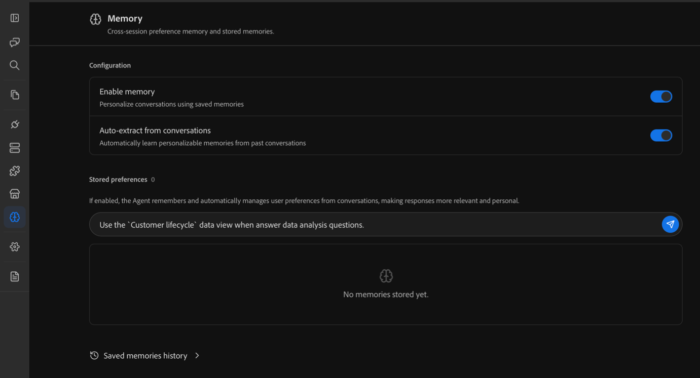
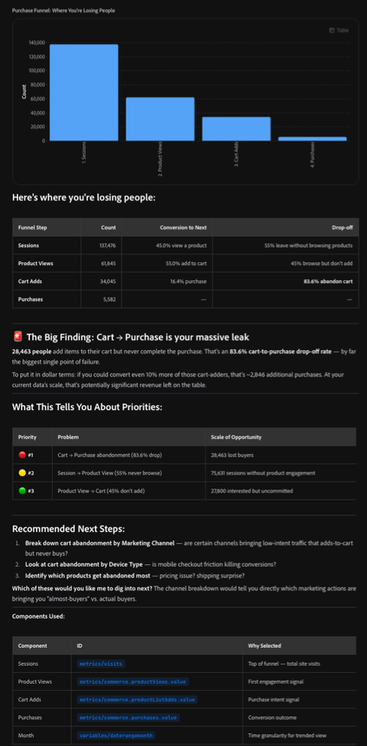
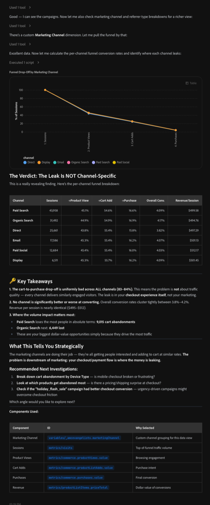
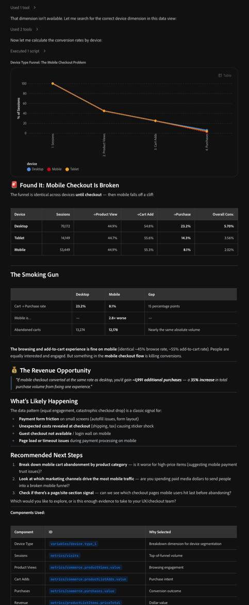

# Analyze Customer Journey Analytics data with Coworker Chat

>[!AVAILABILITY]
>
>The functionality described in this article is in the Limited Testing phase of release and might not be available yet in your environment. This note will be removed when the functionality is generally available. For information about the Customer Journey Analytics release process, see [Customer Journey Analytics feature releases](https://experienceleague.adobe.com/en/docs/analytics-platform/using/releases/latest).

Adobe CX Enterprise Coworker Chat can perform advanced data analysis that was previously possible only in Analysis Workspace. Coworker Chat accesses data from your Customer Journey Analytics data views, allowing you to explore that data and get answers to natural-language prompts.

Before you begin your analysis, learn about the Coworker Chat interface and configuration options, then make sure Coworker is connected to Customer Journey Analytics and to the data view that contains the data you want to use.

## Get started with Coworker Chat

### Interface and configuration options

Before you use Coworker Chat with your Customer Journey Analytics data, learn how to sign in and manage configuration options for the following features:

* Chat inputs

* Conversations

* Marketplaces

* MCP servers

* Memory

* Plugins

* Skills

* And more

For more information, see the [Coworker Chat UI guide](https://experienceleague.adobe.com/en/docs/cx-enterprise-coworker/content/chat/ui-guide).

### Use cases for Customer Journey Analytics

You can see Customer Journey Analytics use cases and sample prompts that practitioners are using in Adobe CX Enterprise Coworker Chat. Each prompt is built to be copied, adapted with your own data and context, and refined through conversation.

For more information, see [Use cases](https://experienceleague.adobe.com/en/docs/cx-enterprise-coworker/content/chat/use-cases).

## Verify that Coworker Chat is connected to Customer Journey Analytics

1. In Coworker Chat, verify that Coworker is connected to Customer Journey Analytics:

1. Select the MCP icon in the left rail, then make sure that [!UICONTROL **cja-mcp**] is available in your list of connected MCP servers.

   

1. (Conditional) If [!UICONTROL **cja-mcp**] is not yet connected, select [!UICONTROL **Add MCP Server**], specify cja in the [!UICONTROL **Server Name**] field and select it when it appears, then select [!UICONTROL **Add Server**].

## Connect to the right data view

A data view is a container in Customer Journey Analytics that determines how data is interpreted.

You might have access to various data views in Customer Journey Analytics, each containing different dimensions and metrics that Coworker can use when analyzing data.

### Decide which data views you want to use

Tell Coworker the types of questions you want answered, and ask it which data views you have access to that would be best to provide that information. You can also [set your data view as a preference in memory](#add-a-data-view-preference-in-memory).

**You:**

>[!BEGINSHADEBOX]

I'm interested in learning where customers drop off in the customer journey. Which data views in Customer Journey Analytics do I have access to that would be able to answer this question for me? 

>[!ENDSHADEBOX]

**Coworker Chat response:**

>[!BEGINSHADEBOX]

You have access to three data views. The `Customer lifecycle` data view contains the following dimensions and metrics, which would be best for answering your question.

>[!ENDSHADEBOX]

**You:**

>[!BEGINSHADEBOX]

Great, let's use that data view.

>[!ENDSHADEBOX]

**Coworker Chat response:**

>[!BEGINSHADEBOX]

Okay, I'll use the `Customer lifecycle` data view to answer future questions in this chat session.

>[!ENDSHADEBOX]

### Add a data view preference in Memory

Coworker Chat contains a memory feature that allows you to provide it with access to information that spans across all chats. It's a good practice to add your prefered data views as preferences in Coworker's memory.

1. In Coworker Chat, in the left nav, select the Memory icon.

1. On the Memory page, in the Stored preferences section, specify one or more data views that you want Coworker Chat to use in your chats.

   

## Analyze in Customer Journey Analytics

After Coworker creates a visualization, you can open the visualization in Analysis Workspace in Customer Journey Analytics for deeper analysis with more granular control. The visualization opens in a new Analysis Workspace project in Customer Journey Analytics.

To open a visualization in new Analysis Workspace project:

1. Select [!UICONTROL **Analyze in CJA**] next to any visualization that is created in Coworker.

1. With the visualization open in Customer Journey Analytics, you can use the Analysis Workspace drag-and-drop browser interface to make modifications, further craft your analysis, create an audience, and much more. You can even share your Workspace project with anyone you choose.

   For more information about Analysis Workspace, see [Analysis Workspace overview](https://experienceleague.adobe.com/en/docs/analytics-platform/using/cja-workspace/home).

## Example: Find where customers drop off

You can ask Coworker Chat to use your data to analyze any business question.

For example, as a marketing manager, merchandiser, or growth lead, you might want to understand where customers abandon the path to purchase, why they did, and what can be done to drive higher conversion rates.

>[!NOTE]
>
>The figures below are illustrative sample data for a fictional retailer, [!DNL TechPulse Electronics], used to show the shape of the conversation.

### The types of questions you can ask

You don't need to know what a "fallout visualization" is, or which metric goes in which slot. Instead, describe the outcome you care about in plain language:

* "Where are we losing people on the way to purchase?"
* "What's my full conversion funnel, from product view to checkout?"
* "Which marketing channels leak the most between cart and purchase?"
* "Is cart abandonment worse on mobile or desktop?"
* "Do people from paid social convert differently than people from email?"

### The conversation

#### 1. Start with the business question

**You:**

>[!BEGINSHADEBOX]

Where are we losing people on the way to purchase?

>[!ENDSHADEBOX]

**Coworker Chat response:**

Notice that Coworker Chat chooses the right visualization, sequences the touchpoints, and even adds recommended next steps. 

>[!BEGINSHADEBOX]

This is a funnel question — let me run the conversion funnel to see where drop-off happens on the path to purchase.

Here's where you're losing people:

| Funnel step | Count | Conversion to next | Drop-off |
| --- | --- | --- | --- |
| Sessions | 137,476 | 45.0% view a product | 55% leave without browsing products |
| Product views | 61,845 | 55.0% add to cart | 45% browse but don't add |
| Cart adds | 34,045 | 16.4% purchase | 83.6% abandon cart |
| Purchases | 5,582 | — | — |

**The big finding: cart to purchase is your biggest leak**

28,463 people add items to their cart but never complete the purchase. That's an 83.6% cart-to-purchase drop-off rate — by far the largest single point of failure.

To put it in dollar terms, converting just 10% more of those cart-adders would add about 2,846 purchases. At the current data scale, that's potentially significant revenue left on the table.

**What this tells you about priorities:**

| Priority | Problem | Scale of opportunity |
| --- | --- | --- |
| #1 | Cart to purchase abandonment (83.6% drop) | 28,463 lost buyers |
| #2 | Session to product view (55% never browse) | 75,631 sessions without product engagement |
| #3 | Product view to cart (45% don't add) | 27,800 interested but uncommitted |

**Recommended next steps:**

1. Break down cart abandonment by marketing channel — are certain channels bringing low-intent traffic that adds to cart but never buys?
1. Look at cart abandonment by device type — is mobile checkout friction killing conversions?
1. Identify which products get abandoned most — pricing issue? Shipping surprise?

**Which of these would you like me to dig into next?** The channel breakdown would tell you directly which marketing actions are bringing you "almost-buyers" versus actual buyers.

>[!ENDSHADEBOX]

#### 2. Drill into the leak

**You:**

>[!BEGINSHADEBOX]

Okay, let's break down by marketing channel

>[!ENDSHADEBOX]

**Coworker Chat response:**

>[!BEGINSHADEBOX]

There's a custom **Marketing Channel** dimension. Let me pull the funnel by that, then calculate the per-channel conversion rates and identify where each channel leaks.

**The verdict: the leak is not channel-specific**

This is a really revealing finding. Here's the per-channel funnel breakdown:

| Channel | Sessions | To product view | To cart add | To purchase | Overall conversion | Revenue/session |
| --- | --- | --- | --- | --- | --- | --- |
| Paid search | 43,958 | 45.1% | 54.6% | 16.6% | 4.09% | $499.58 |
| Organic search | 31,492 | 44.9% | 54.9% | 16.9% | 4.17% | $494.76 |
| Direct | 25,661 | 43.6% | 55.4% | 15.8% | 3.82% | $497.29 |
| Email | 17,586 | 45.3% | 55.4% | 16.2% | 4.07% | $501.13 |
| Paid social | 12,684 | 45.4% | 55.7% | 16.0% | 4.03% | $512.17 |
| Display | 6,511 | 45.3% | 55.7% | 16.2% | 4.09% | $501.45 |

**Key takeaways:**

1. The cart-to-purchase drop-off is uniformly bad across all channels (83-84%). This means the problem isn't about traffic quality — every channel delivers similarly engaged visitors. The leak is in your checkout experience itself, not your marketing.
1. No channel is significantly better or worse at converting. Overall conversion rates cluster tightly between 3.8% and 4.2%, and revenue per session is nearly identical ($495-$512).
1. Where the volume impact matters most: paid search loses the most people in absolute terms (9,015 cart abandonments), followed by organic search (6,449 lost). These are the biggest dollar-value opportunities because they drive the most traffic.

**What this tells you strategically**

The marketing channels are doing their job — they're all getting people interested and adding to cart at similar rates. The problem is downstream of marketing: your checkout and payment flow is where the money is leaking.

**Recommended next investigations:**

1. Break down cart abandonment by device type — is mobile checkout broken or frustrating?
1. Look at which products get abandoned most — is there a pricing or shipping surprise at checkout?
1. Check if the "holiday_flash_sale" campaign had better checkout conversion — urgency-driven campaigns might overcome checkout friction

**Which angle would you like to explore next?**

>[!ENDSHADEBOX]

#### 3. Keep investigating

**You:**

>[!BEGINSHADEBOX]

Interesting. Let's trying breaking down by device type.

>[!ENDSHADEBOX]

**Coworker Chat response:**

>[!BEGINSHADEBOX]

**Found it: mobile checkout is broken**

The funnel is identical across devices until checkout — then mobile falls off a cliff:

| Device | Sessions | To product view | To cart add | To purchase | Overall conversion |
| --- | --- | --- | --- | --- | --- |
| Desktop | 70,172 | 44.9% | 54.8% | 23.2% | 5.70% |
| Tablet | 14,149 | 44.7% | 55.6% | 14.3% | 3.56% |
| Mobile | 53,449 | 44.9% | 55.3% | 8.1% | 2.02% |

**The smoking gun**

| Metric | Desktop | Mobile | Gap |
| --- | --- | --- | --- |
| Cart to purchase rate | 23.2% | 8.1% | 15 percentage points |
| Mobile is | — | 2.8x worse | — |
| Abandoned carts | 13,274 | 12,178 | Nearly the same absolute volume |

The browsing and add-to-cart experience is fine on mobile (identical ~45% browse rate, ~55% add-to-cart rate). People are equally interested and engaged. But something in the mobile checkout flow is killing conversions.

**The revenue opportunity**

If mobile checkout converted at the same rate as desktop, you'd gain ~1,991 additional purchases — a 35% increase in total purchase volume from fixing one experience.

**What's likely happening**

The data pattern (equal engagement, catastrophic checkout drop) is a classic signal for:

* Payment form friction on small screens (autofill issues, form layout)
* Unexpected costs revealed at checkout (shipping, tax) causing sticker shock
* Guest checkout not available or a login wall on mobile
* Page load or timeout issues during payment processing on mobile

**Recommended next steps:**

1. Break down mobile cart abandonment by product category — is it worse for high-price items (suggesting mobile payment trust issues)?
1. Look at which marketing channels drive the most mobile traffic — are you spending paid media dollars to send people into a broken mobile funnel?
1. Check if there's a page or site-section signal — can we see which checkout pages mobile users hit last before abandoning?

**Which would you like to explore, or is this enough evidence to take to your UX and checkout team?**

>[!ENDSHADEBOX]

#### 4. Turn it into a decision

**You:**

>[!BEGINSHADEBOX]

So what should I do?

>[!ENDSHADEBOX]

**Coworker Chat response:**

>[!BEGINSHADEBOX]

Based on what the data shows, here's where I'd focus:

* **Fix the mobile checkout — it's not a channel problem.** Every channel is converting people into the cart at a similar, healthy rate, so the ad spend is working across the board. The revenue is being lost specifically in the mobile checkout flow, which is where the fix belongs.
* **Start with payment and form friction.** These are the most common reasons high-intent mobile shoppers abandon a cart. Offering mobile wallet options and shortening the form are usually the fastest wins.
* **Re-check after the fix.** Once checkout changes ship, watch whether mobile's cart-to-purchase rate moves toward the desktop rate of 23.2%.

Want me to save this as a project so you can track it, or set an alert if mobile cart-to-purchase drops below a threshold?

>[!ENDSHADEBOX]

### What just happened

In four plain-language questions, Coworker helped us:

* Build a multi-step conversion funnel and flag cart-to-purchase as the biggest leak
* Rule out marketing channel as the cause — every channel leaked at nearly the same rate
* Isolate the real problem to mobile checkout, and quantify the fix at a 35% lift in purchases
* Walk away with a specific fix to prioritize: mobile payment and form friction. This is benchmarked against desktop's 23.2% conversion rate

<!--

## Example #2: Find which marketing efforts drive revenue

You can ask Coworker Chat to use your data to analyze any business question.

For example, as a marketing manager, demand generation lead, or CMO, you might want to know which marketing efforts actually deserve credit for revenue so you can confidently decide where to put your marketing spend, rather than rewarding whichever channel happened to get the last click.

>[!NOTE]
>
>The figures below are illustrative sample data for a fictional retailer, [!DNL TechPulse Electronics], used to show the shape of the conversation.

### The types of questions you can ask

You don't need to know what an "attribution model" is, or how to configure an Attribution panel. Instead, describe the outcome you care about in plain language:

* "Which channels actually drive our revenue, not just the last click?"
* "If I change how I give credit for a sale, does my best channel change?"
* "Which campaigns start customer journeys versus close them?"
* "Am I over-investing in paid search because it always gets the last click?"
* "What role does email play in conversions it never gets credit for?"

### The conversation

#### 1. Start with the business question

**You:**

>[!BEGINSHADEBOX]

Which marketing channels actually drive our revenue?

>[!ENDSHADEBOX]

**Coworker Chat response:**

Notice that Coworker Chat picks the right analysis, starts with the model most reports default to, and immediately flags what that model can't tell you.

>[!BEGINSHADEBOX]

This is an attribution question — let me attribute revenue to your marketing channels so you can see who's earning it.

I'll start with **last-touch attribution**, since that's what most out-of-the-box reports show. It gives all the credit for a sale to the last channel a person used before purchasing.

| Marketing channel | Attributed revenue (last touch) | Share |
| --- | --- | --- |
| Paid search | $948,000 | 34% |
| Organic search | $614,000 | 22% |
| Direct | $474,000 | 17% |
| Email | $307,000 | 11% |
| Paid social | $251,000 | 9% |
| Display | $195,000 | 7% |

**The headline: paid search looks like your hero**

Under last touch, paid search earns a third of all revenue — more than any other channel. If this were the only view you had, you'd likely pour more budget into paid search.

**One important caveat before you do that**

Last touch only tells you who *closed* the sale. It says nothing about who *started* the journey or *assisted* along the way. A channel that introduces people to your brand weeks before they buy gets zero credit here, even if the purchase never would've happened without it.

To know whether paid search is really driving revenue — or just harvesting demand other channels created — you need to compare attribution models.

**Recommended next step:**

Compare the same channels across first-touch, last-touch, and linear models. If paid search stays on top across all of them, it's a genuine driver. If it shrinks under first touch, it's a closer, not a creator.

**Want me to run that comparison?**

>[!ENDSHADEBOX]

#### 2. Compare attribution models

**You:**

>[!BEGINSHADEBOX]

Yes, compare it across models.

>[!ENDSHADEBOX]

**Coworker Chat response:**

>[!BEGINSHADEBOX]

Here's each channel's share of revenue under three models. First touch credits the channel that started the journey, last touch credits the one that closed it, and linear splits credit evenly across every touch.

| Marketing channel | First touch | Last touch | Linear |
| --- | --- | --- | --- |
| Paid search | 19% | 34% | 26% |
| Organic search | 20% | 22% | 21% |
| Direct | 9% | 17% | 13% |
| Email | 18% | 11% | 15% |
| Paid social | 21% | 9% | 15% |
| Display | 13% | 7% | 10% |

**The verdict: your "best" channel depends entirely on how you count**

This is the finding that changes budget decisions.

1. **Paid search closes far more than it starts.** It jumps from 19% of first touches to 34% of last touches. That's the signature of a *harvester* — it captures people who are already ready to buy, often after another channel introduced them. Valuable, but it's finishing journeys, not creating them.
1. **Paid social and email are badly undercredited by last touch.** Paid social starts 21% of journeys but gets credit for only 9% of sales. Email starts 18% but closes 11%. These channels are doing the expensive work at the top of the funnel and handing warm prospects to paid search.
1. **Organic search is your steady workhorse.** It sits around 20% across every model — it both starts and closes journeys reliably.

**Why this matters for budget**

If you cut paid social or email based on their weak last-touch numbers, you'd starve the top of your funnel — and paid search would have far fewer ready-to-buy people to close. You'd likely see paid search revenue fall too, even though you didn't touch its budget.

**Recommended next step:**

Look at the campaign level to see exactly which efforts start journeys versus close them. That's where you can act — trimming or protecting specific campaigns rather than whole channels.

**Want me to break this down by campaign?**

>[!ENDSHADEBOX]

#### 3. Keep investigating

**You:**

>[!BEGINSHADEBOX]

Let's break it down by campaign.

>[!ENDSHADEBOX]

**Coworker Chat response:**

>[!BEGINSHADEBOX]

There's a **Campaign Name** dimension. Here are your highest-involvement campaigns, comparing the revenue they start (first touch) against the revenue they close (last touch).

| Campaign | Starts (first touch) | Closes (last touch) | Role |
| --- | --- | --- | --- |
| brand_awareness_q3 | $412,000 | $103,000 | Initiator |
| email_winback | $214,000 | $88,000 | Initiator |
| holiday_flash_sale | $268,000 | $249,000 | All-rounder |
| retargeting_dynamic | $71,000 | $339,000 | Closer |
| branded_search_always_on | $84,000 | $498,000 | Closer / harvester |

**The pattern: some of your "worst" campaigns are actually your best starters**

* **brand_awareness_q3** and **email_winback** start far more revenue than they close. On a last-touch ROI report, these look like underperformers you might cut. In reality, they're filling the top of your funnel — the journeys other campaigns finish.
* **retargeting_dynamic** and **branded_search_always_on** are the opposite. They close a lot but start almost nothing. They're efficient closers, but they can only close demand that already exists. Branded search, in particular, is largely capturing people who were going to search for you by name anyway.
* **holiday_flash_sale** does both — it introduces new shoppers and closes them, which is why urgency-driven promotions often look strong under any model.

**What this tells you strategically**

The campaigns you'd cut first on a last-touch report — the awareness and win-back efforts — are the ones creating the demand your closers depend on. Judge initiators on the journeys they start, and closers on the journeys they finish.

**Recommended next steps:**

1. Protect the initiator campaigns even though their last-touch ROI looks weak — they're feeding the funnel.
1. Right-size the branded search spend — test whether trimming it changes total revenue, since much of that demand may convert anyway.
1. Adopt a balanced model — like linear or a position-based model — as your default reporting view, so no channel gets systematically over- or under-rewarded.

**Want me to save this as a project, or is this enough to take into your budget planning?**

>[!ENDSHADEBOX]

#### 4. Turn it into a decision

**You:**

>[!BEGINSHADEBOX]

So how should I allocate budget?

>[!ENDSHADEBOX]

**Coworker Chat response:**

>[!BEGINSHADEBOX]

Based on what the data shows, here's where I'd focus:

* **Stop judging upper-funnel channels on last touch alone.** Paid social and email start about 20% of your revenue each, but last touch credits them for less than half of that. Protect their budgets — they're creating the demand paid search closes.
* **Treat branded search as a harvester, not a driver.** It closes a lot but starts almost nothing. Test trimming it, since much of that demand may convert through other paths anyway.
* **Make a balanced model your default.** Reporting on linear or a position-based model instead of last touch will stop you from over-rewarding closers and under-funding the channels that start journeys.
* **Re-check after you rebalance.** Watch whether total revenue holds steady as you shift spend toward initiators — that's the signal your funnel is healthier, not just your last-touch report.

Want me to save this as a project so you can track it, or build a calculated metric that reports revenue on a balanced attribution model going forward?

>[!ENDSHADEBOX]

### What just happened

In four plain-language questions, Coworker helped us:

* Attribute revenue to marketing channels and flag that the default last-touch view tells only part of the story
* Compare attribution models and reveal that the "best" channel changes completely depending on how credit is counted
* Discover that paid social and email start far more revenue than they ever get credit for closing
* Identify which campaigns initiate journeys versus close them, and walk away with a budget direction: protect the initiators, right-size the harvesters, and report on a balanced model

-->
