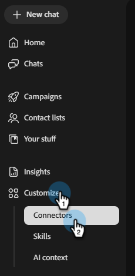

# Connect to Salesforce {#salesforce}

Adobe Coworker Campaigns allows you to connect your Salesforce account to access your leads and contacts.

>[!PREREQUISITES]
>
>To use this connector, you must first have:
>
>* An active Salesforce account
>* The following permissions in Salesforce: `api`, `sobjects.Contact.read`, `sobjects.Campaign.read`, `sobjects.CampaignMember.read`
>* Your Salesforce Instance URL, [Client ID, and Client secret](https://help.salesforce.com/s/articleView?id=xcloud.remoteaccess_oauth_client_credentials_flow.htm&type=5#:~:text=DESCRIPTION-,client_id,-The%20consumer%20key) handy

## How to connect

1. On the [Coworker Campaigns homepage](https://coworker-campaigns.experience.adobe.com/), click **Customize** and select **Connectors**.

   

1. Click **Add integration**.

   

   >[!NOTE]
   >
   >If this is not your first integration, the button will read "Add connector."

1. In the Salesforce row, click **Connect**.

   

1. Enter your Salesforce **instance URL**, **Client ID**, and **Client secret**. Click **Connect**.

   >[!NOTE]
   >
   >* In Salesforce, Client ID = Consumer Key and Client secret = Consumer Secret.
   >
   >* While in your Salesforce account, you can find your Instance URL in your browser's address bar, or by navigating to **Setup** > **Company Settings** > **My Domain**.

   

After connection, Salesforce appears in the Connectors list and can be selected when linking a lead or contact list to sync from Salesforce.

**To disconnect:**

1. In the Connectors screen, find the Salesforce tile and click **Manage**.

   

1. Click **Disconnect** (no need to re-enter your Client secret at this time).

   

1. Click **Disconnect** again to confirm.

   
