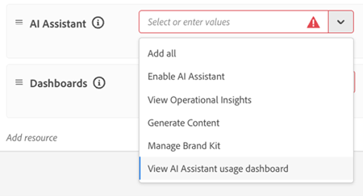
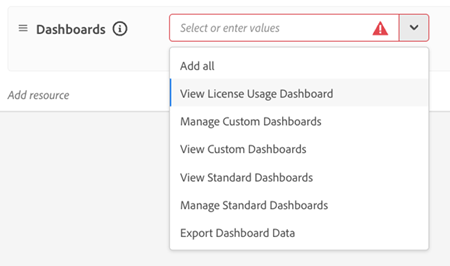
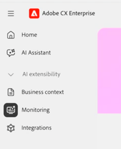

# Agentic AI Monitoring dashboards

The Agentic AI monitoring dashboard gives Center of Excellence (COE) members and other governance stakeholders visibility into agentic AI usage and adoption. View 7-day or 30-day trends to see who uses [!DNL AI Assistant] or other surfaces (such as [Adobe Marketing Agent for Microsoft 365 Copilot](https://experienceleague.adobe.com/en/docs/experience-cloud-ai/experience-cloud-ai/agents/ama-ms)) to interact with [!DNL Experience Platform Agents] and the value they receive. Together, these views help you guide agent adoption with data instead of assumptions. 

**Availability**

* Currently, any account with a license to at least one Experience Platform native application (Customer Journey Analytics, Journey Optimizer, or Real-Time CDP) can access this dashboard
* Usage and adoption metrics for [AI-first applications](agentic-ai.md#ai-first-cx-enterprise-applications) like Experimentation Accelerator, LLM Optimizer, and Sites Optimizer are not in scope for this dashboard.

The [!UICONTROL Monitoring] dashboard includes the following views:

| Dashboard | Purpose |
| --- | --- |
| **Overview** | Aggregated metrics across users, conversations, feedback, and credit consumption |
| **Users** | Usage frequency, distribution, and engagement by user |
| **Feedback** | Signals on response quality and user satisfaction |
| **AI Credits** | Credit consumption trends and remaining balance |

The [Agentic AI in Adobe CX Enterprise](agentic-ai.md) documentation lists the agents in scope for usage monitoring in [AI agents in existing CX Enterprise apps](agentic-ai.md#existing-apps-table).

>[!VIDEO](https://video.tv.adobe.com/v/3491864?learn=on)

## Enable dashboard permissions {#permissions}

Grant dashboard access in [!DNL Adobe Experience Platform] by updating the product profile or role for each authorized user. The [!UICONTROL Monitoring] feature displays to users on the CX Enterprise home page after permissions are enabled. 

>[!IMPORTANT]
>
>Monitoring data is available only in the default production sandbox. Development sandboxes are not supported for viewing monitoring data. Users must have the required Monitoring permissions for the default production sandbox and switch to that sandbox to view monitoring data. 
>
>To help prevent confusion, Adobe recommends granting Monitoring permissions across all sandboxes, including the default production sandbox. This helps ensure that users can access the Monitoring dashboard regardless of the currently selected sandbox and reduces the likelihood of mistaking an unsupported sandbox for an empty or nonfunctional dashboard.

**To enable dashboard permissions**

1. Go to [!DNL Experience Platform] **Administration** > **Permissions**. 

1. Open the product profile or role you want to update.

   

1. Under **[!UICONTROL AI Assistant]** permissions, click **[!UICONTROL Add Resource]**, then enable **[!UICONTROL View AI Assistant usage dashboard]**.

   This permission grants access to the Agentic AI usage monitoring dashboards.

1. Under **[!UICONTROL Dashboards]** permissions, configure dashboard access based on each user's responsibilities.

   

   Recommended permissions for authorized governance users:

   * **[!UICONTROL View License Usage Dashboard]**
   * **[!UICONTROL View Standard Dashboards]**
   * **[!UICONTROL Export Dashboard Data]** (optional, for approved governance users only)

   Additional permissions you can grant when needed:

   * **[!UICONTROL Manage Custom Dashboards]**
   * **[!UICONTROL View Custom Dashboards]**
   * **[!UICONTROL Manage Standard Dashboards]**

1. To view dashboards, return to the CX Enterprise home, then click **[!UICONTROL Monitoring]**.

   

## Overview dashboard

The Overview dashboard is the central place for adoption and engagement metrics across your organization. It connects high-level trends to deeper analysis. To see what drives the numbers, drill into individual conversations from any metric.

### Metrics on the Overview dashboard

* **Prompts over time:** Overall usage growth and adoption trends.
* **Active users and conversations:** Count of users interacting with [!DNL Experience Platform Agents].
* **Average prompts per conversation:** Depth of engagement per conversation.
* **Feedback:** Distribution of thumbs up and thumbs down feedback from users (for [!DNL AI Assistant] interactions only).

>[!VIDEO](https://video.tv.adobe.com/v/3491865?learn=on)

### Conversation replay

Conversation replay shows individual interactions, not only aggregates. You can analyze patterns across many conversations and move from high-level trends to a specific conversation.

* **Prompt and response history:** The user's prompt and the responses delivered.
* **Feedback signals:** Interactions users marked with thumbs up or thumbs down, to identify friction, blockers, or enablement needs. This information helps your organization improve prompt relevance and helps Adobe improve response quality over time.

>[!VIDEO](https://video.tv.adobe.com/v/3491866?learn=on)

## Users dashboard

The Users dashboard shows how agent adoption and engagement vary across users over time. You can see who actively uses [!DNL Experience Platform Agents], which surface they use, and how often they engage. Administrators and COE members can drill into individual user activity and conversations to understand engagement patterns and usage behavior.

### Metrics on the Users dashboard

* **Adoption and engagement trends over time:** Track how user segments change during the selected period. Users are classified as:
  * **New:** First activity in the selected period, with no activity during the previous 12 months.
  * **Repeat:** Activity in both the selected period and the previous period.
  * **Return:** Activity in the selected period, but not in the previous period.
  * **Inactive:** No activity in the selected period, but activity in the previous period.
* **User engagement patterns:** How frequently users interact with agents and how engagement changes over time.
* **Conversation activity:** Number of conversations and prompts per user.
* **Top active users:** Highly engaged users and teams driving agent adoption.

>[!VIDEO](https://video.tv.adobe.com/v/3491868?learn=on)

## Feedback dashboard

The Feedback dashboard shows user feedback submitted for agent interactions. You can see which conversations users marked positively or negatively and investigate the interactions behind the feedback. To review prompts, responses, reasoning details, and feedback notes, drill into individual conversations from feedback summaries.

### Metrics on the Feedback dashboard

* **Feedback trends over time:** How user feedback changes over time.
* **Thumbs up and thumbs down feedback:** Positive and negative interaction signals.
* **Feedback categories:** Rationale behind each thumbs up and thumbs down.
* **Prompt and response history:** User prompts and the responses associated with submitted feedback.
* **Feedback details and notes:** Additional context and comments from users during feedback submission.

>[!VIDEO](https://video.tv.adobe.com/v/3491878?learn=on)

## AI Credits dashboard

The AI Credits dashboard shows how your organization's use of [!DNL Experience Platform Agents] translates into AI Credits consumption.

### Metrics on the AI Credits dashboard

* **Total AI Credits consumed:** Overall agent usage in AI Credits.
* **Daily and monthly trends:** Spikes, dips, and changes in consumption patterns.
* **AI Credits remaining:** Remaining balance so you can plan proactively and avoid overages.

>[!VIDEO](https://video.tv.adobe.com/v/3491867?learn=on)

## More help on this topic

* [License usage dashboard](https://experienceleague.adobe.com/en/docs/experience-platform/dashboards/guides/license-usage) in [!DNL Experience Platform]
* [Agentic AI in Adobe CX Enterprise](agentic-ai.md)
* [Agent jobs and AI credit consumption](ai-credit-consumption.md)
* [License usage dashboard](https://experienceleague.adobe.com/en/docs/experience-platform/dashboards/guides/license-usage) (Experience Platform)
